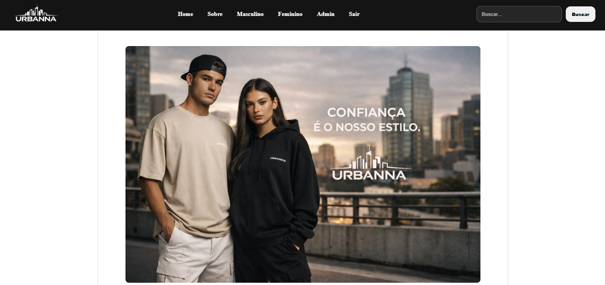
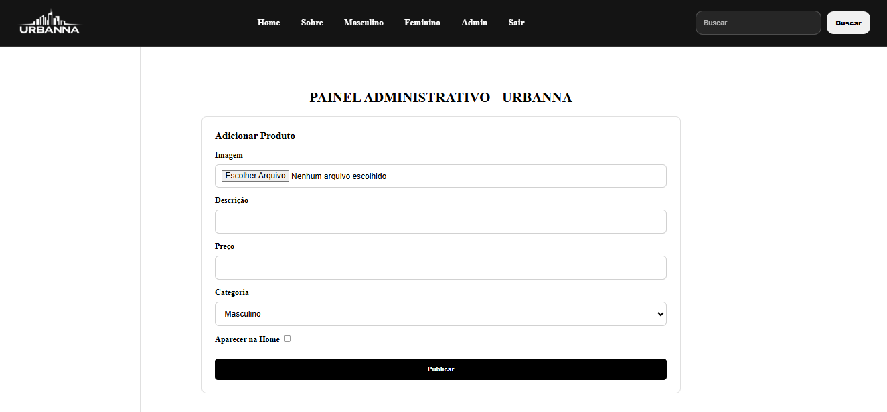
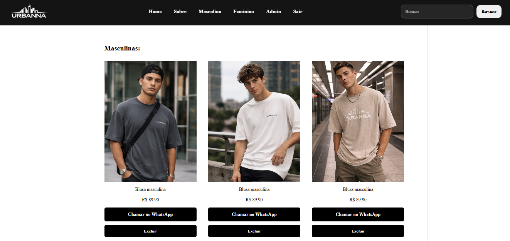

# 🛍 Urbanna — Sistema Web com Painel Administrativo

Aplicação web desenvolvida com **Flask + SQLAlchemy**, projetada como vitrine digital para lojas de moda, com painel administrativo para gerenciamento completo de produtos.

O projeto demonstra estrutura backend organizada, autenticação administrativa segura, upload validado de imagens e sistema de busca dinâmica.

> 🔥 **Versão Comercial:** inclui integração direta com WhatsApp.

---

## 🖼️ Imagens do Projeto

### Home


### Painel Administrativo


### Sessão Masculina


---

## 🚀 Funcionalidades

### 👤 Área Pública
- Página inicial com produtos em destaque
- Listagem por categoria (Masculino / Feminino)
- Sistema de busca por descrição ou categoria
- Exibição dinâmica de produtos cadastrados

### 🔐 Painel Administrativo
- Login protegido por senha criptografada
- Cadastro de produtos com upload de imagem
- Marcação de produto como destaque
- Exclusão de produtos
- Feedback visual com Flash Messages

---

## 📲 Integração com WhatsApp (Versão Comercial)

A versão comercial do sistema inclui:

- Botão de compra com redirecionamento automático para WhatsApp
- Envio pré-formatado de mensagem com nome do produto
- Aplicável para pequenos comércios locais

Essa funcionalidade transforma a aplicação em uma solução prática para lojas físicas que desejam vender online sem necessidade de gateway de pagamento.

---

## 🛠️ Stack Utilizada

- Python
- Flask
- Flask-SQLAlchemy
- Flask-WTF
- Flask-Bcrypt
- SQLite
- HTML + CSS

---

## 🧠 Arquitetura

````
/raiz
│
├── main.py
├── requirements.txt
├── models.py
├── forms.py
├── routes.py
├── criar_banco.py
│
├── static/
│   └── fotos_posts/
│   └── fotos_site/
│   └── fotos_css/
│
├── templates/
│
└── assets/
    └── home.png
    └── login.png
    └── masculino.png
````
---

## 🔐 Segurança

- Credenciais administrativas via variáveis de ambiente
- Senha protegida com hash Bcrypt
- Sessão protegida via `session`
- Validação de upload com:
  - `FileRequired`
  - `FileAllowed`
- Tratamento seguro de nome de arquivos com `secure_filename`
- Proteção de rotas administrativas

---

## 🗄️ Modelagem do Banco

### Produto

- id
- imagem
- descricao
- preco (Decimal)
- categoria
- is_destaque (Boolean)
- criado_em (DateTime com timezone)

---

## ⚙️ Configuração do Projeto

### 1️⃣ Clonar

```
git clone <url-do-repositorio>
cd UrbannaSite
````

### 2️⃣ Criar ambiente virtual
````
python -m venv venv
````

Windows
````
venv\Scripts\activate
````

Mac/Linux
````
source venv/bin/activate
````

### 3️⃣ Instalar dependências
````
pip install flask flask-sqlalchemy flask-wtf flask-bcrypt python-dotenv email-validator
````
### 4️⃣ Criar .env
````
SECRET_KEY=sua_chave_secreta
DATABASE_URL=sqlite:///database.db
UPLOAD_FOLDER=static/fotos_posts
ADMIN_USERNAME=admin
ADMIN_PASSWORD_HASH=hash_gerado_com_bcrypt
````
### 5️⃣ Criar banco
````
python criar_banco.py
````
### 6️⃣ Rodar aplicação
````
flask run
````

Acessar:
````
http://127.0.0.1:5000

````

## 🎯 Objetivo do Projeto

Este projeto demonstra:

Estruturação profissional de aplicação Flask

Organização modular (rotas, modelos e formulários)

Implementação de autenticação administrativa

Manipulação segura de arquivos

Integração comercial com WhatsApp

Preparação para uso real em pequenos negócios

## 📌 Próximas Evoluções

Sistema de edição de produtos

Paginação nas listagens

Dashboard administrativo com métricas

Integração com gateway de pagamento

## 👨‍💻 Autor

Antony Severo

Desenvolvedor Backend | Python | Flask 

Fortaleza - CE
